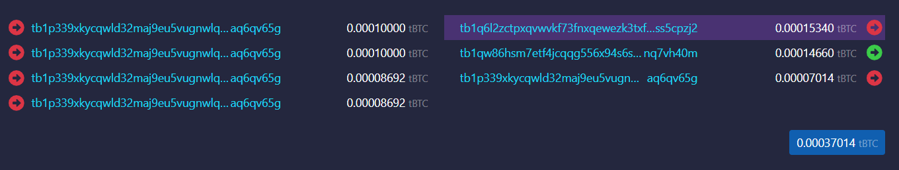
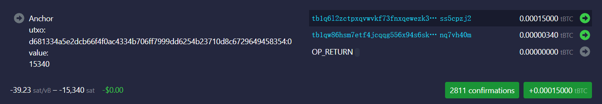
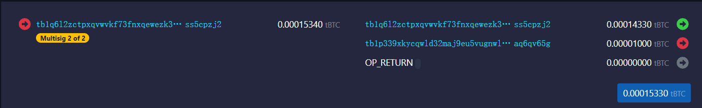
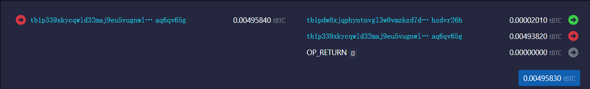
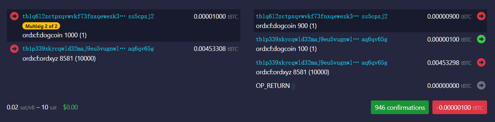
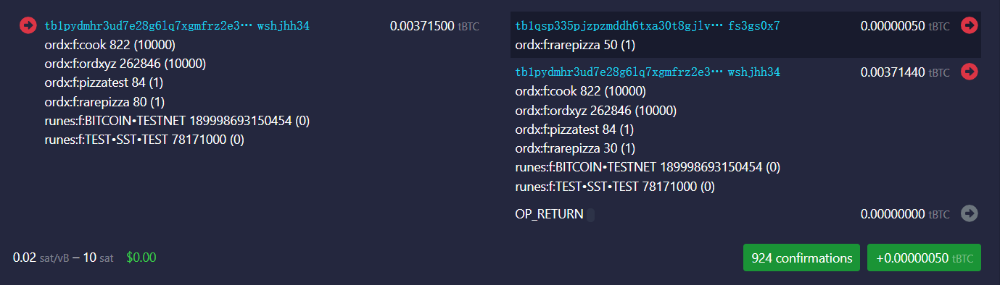
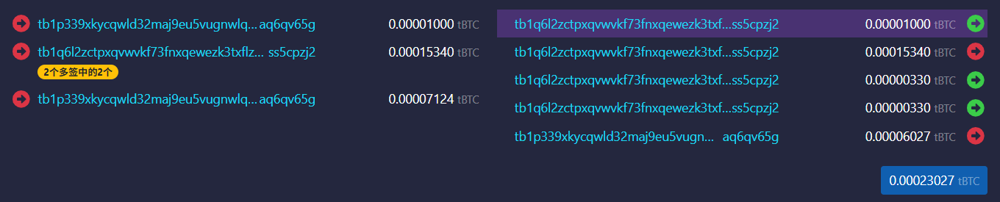
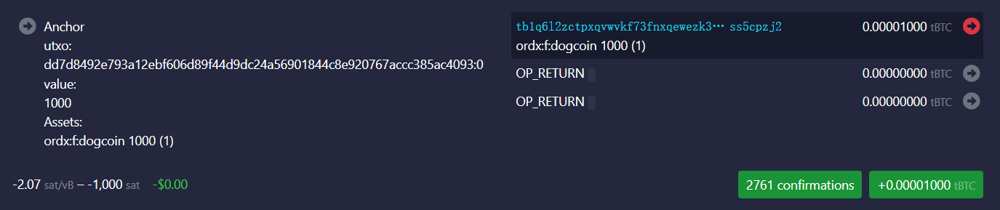
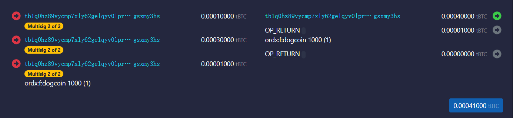
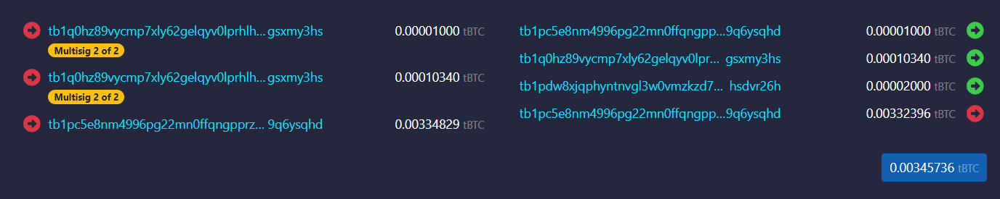

Satoshi Transcending Protocol -- BitBridge
====

SAT20's STP protocol is a protocol for transcending assets between the BTC mainnet and the SatoshiNet. Its features include:
1. Based on the Lightning Network channel RSMC protocol, users retain ultimate control over their assets, protected by the BTC mainnet.
2. Channels are generated using both the user's wallet public key and the public key of the core node providing access services, requiring signatures from both parties for operation.
3. Channel operations are initiated by the user, and the core node providing access automatically responds under the control of the STP protocol.
4. Anyone can open and close channels, without permission.

These features make the STP protocol a completely decentralized asset bridge, independent of any centralized node. Users maintain absolute control throughout the entire process. The STP protocol is a "bridgeless bridge," a name we've given to this bridge, in keeping with the spirit of BTC: BitBridge.

The STP protocol provides the following six atomic operations.

Opening a Channel
----
Using the SAT20 wallet as an example, the access node and public key for the SAT20 wallet are:   
Mainnet: 022ab2945f61304f117f55d469c341d606ceb729de436c80c0e6ad7819cdd53ce7  
Testnet: 0367f26af23dc40fdad06752c38264fe621b7bbafb1d41ab436b87ded192f1336e  

Each wallet address corresponds to a public key. This public key and the core node first generate a multi-signature script, which is then used to generate the lightning channel address. The multi-signature script is as follows:
func GenMultiSigScript(aPub, bPub []byte) ([]byte, error) {  
    if bytes.Compare(aPub, bPub) == 1 {  
        aPub, bPub = bPub, aPub  
    }  
    bldr := txscript.NewScriptBuilder(txscript.WithScriptAllocSize(  
        MultiSigSize,  
    ))  
    bldr.AddOp(txscript.OP_2)  
    bldr.AddData(aPub) // Add both pubkeys (sorted)  
    bldr.AddData(bPub)  
    bldr.AddOp(txscript.OP_2)  
    bldr.AddOp(txscript.OP_CHECKMULTISIG)  
    return bldr.Script()  
}  

For example, a wallet public key on the testnet is: 02148cbe135aea8ee9b72f18ca6ddf0efc052e54b6d723cc473a0cc6011766d776  
Its address is: tb1p339xkycqwld32maj9eu5vugnwlqxxfef3dx8umse5m42szx3n6aq6qv65g  
Its channel address is: tb1q6l2zctpxqvwvkf73fnxqewezk3txflzw3se9h82ux9arksekcrss5cpzj2  

As can be seen from the code above, any channel operation requires a signature from both parties to unlock the UTXO in the channel.  

Users must first switch their SAT20 wallet to advanced mode before opening their own channel. Opening a channel creates a transaction similar to this:  

https://mempool.space/testnet4/tx/d681334a5e2dcb66f4f0ac4334b706ff7999dd6254b23710d8c6729649458354

The input on the left is the UTXO from the user's wallet address (tb1p339xkycqwld32maj9eu5vugnwlqxxfef3dx8umse5m42szx3n6aq6qv65g)
The output on the right is:
1. The first output is to the channel address (tb1q6l2zctpxqvwvkf73fnxqewezk3txflzw3se9h82ux9arksekcrss5cpzj2). This portion of the assets will automatically ascend to SatoshiNet (UTXO: d681334a5e2dcb66f4f0ac4334b706ff7999dd6254b23710d8c6729649458354:0).
2. The second output is the service fee for opening the channel. The output address is the channel address of the core node and the bootstrap node. This is a public channel (tb1qw86hsm7etf4jcqqg556x94s6ska9z0239ahl0tslsuvr5t5kd0nq7vh40m).
3. The third output is the change.

After this transaction is confirmed on the mainnet, SatoshiNet will generate a corresponding Ascending TX:  

https://mempool.sat20.org/testnet/tx/b2440213185763316a1ac4c36589053286f1903ba764256e8b4f1f8a6326fe84

As you can see, this transaction on SatoshiNet identifies its mainnet input UTXO (d681334a5e2dcb66f4f0ac4334b706ff7999dd6254b23710d8c6729649458354:0) and the corresponding asset type and amount (Satoshi, 15340). The majority (15,000 satoshis) remain in the channel address (tb1q6l2zctpxqvwvkf73fnxqewezk3txflzw3se9h82ux9arksekcrss5cpzj2), while a small portion is transferred to the common channel address to handle subsequent channel operations. In the Lightning channel ledger, the 15,000 satoshis remaining in the channel address belong entirely to the user.

Unlocking Assets
----
While assets in a channel enjoy the highest level of security, backed by the BTC mainnet, each operation requires the cooperation of service nodes, involves multi-sig operations, and updates to the Lightning channel ledger. Especially when multiple parties are involved, the complexity can rise to an unmanageable level. To simplify the process, users need to unlock assets from the channel address to their personal wallet address.
The unlocking operation is a transaction on the SatoshiNet, transferring a portion of assets from the channel address to a personal address while also updating the commitment transaction.  

https://mempool.sat20.org/testnet/tx/e4183b216442e8009f4393c85e7e8f96f18874d25f668daca499a1501d4cfcd6

In the transaction shown above, 1000 satoshis in the channel address are unlocked to an individual's address.

This allows individuals to independently sign and control these assets on the SatoshiNet. For example,  

https://mempool.sat20.org/testnet/tx/c1368ef641d428b9366ff448ce326e289ca4e6b3c7280f74e653247aa535c235

Unlocking other assets is similar. For example, the following transaction unlocks 100 dogcoins from a channel to a personal address.  

https://mempool.sat20.org/testnet/tx/98e23b9d90c1f7a7074f9967e77b41fdddbbeb4299d5d700a777e8a28dc29069

Locking Assets
---
While assets stored on a personal address on SatoshiNet are protected by the entire SatoshiNet, for users seeking ultimate security, SatoshiNet's security cannot be fully matched to that of the BTC mainnet. In this case, users can lock their assets back into a Lightning channel, thereby gaining the protection of the BTC mainnet.

If the channel has sufficient capacity, the locking operation is simply a transaction on SatoshiNet. It's low-cost and fast, but the effect is astonishing. This simple operation allows users' assets on SatoshiNet to be protected by the mainnet. This locking operation is the reverse of the unlocking operation described above:  

https://mempool.sat20.org/testnet/tx/b3d11311ff5c30c668802da14bf3ee626c39c6113d4a75f3a60e4414687fff18   

In the above transaction, 50 rarepizzas were transferred from the user's personal address tb1p ydmhr3ud7e28g6lq7xgmfrz2e3uzxvw0zatv0d8auhwnatzrqawshjhh34 relocks to channel address tb1qsp335pjzpzmddh6txa30t8gjlv8kurephdtnwz42f7yxd7afrrfs3gs0x7

If the channel does not have sufficient capacity, the lock operation requires a complex and costly set of steps. This is similar to a submarine maneuver in the Lightning Network:
1. By interacting with the common channel's transcending contract, the assets to be locked back into the channel (plus the submarine transaction fee) are transferred to the common channel on SatoshiNet. This is a transaction on SatoshiNet.
2. Upon receiving the funds, the common channel initiates a transaction on the mainnet to transfer the assets to the user's channel address.
3. After the user's channel address receives the transfer, the funds are automatically ascended to SatoshiNet via an Ascending TX, simultaneously updating the Lightning channel's ledger.
Through this complex operation, users can lock their assets back into the channel and enjoy the security of the BTC mainnet, but this incurs a relatively high fee. (Note that this process is not currently implemented.)

Splicing-In
----
Users can transfer more assets to SatoshiNet at any time through the Splicing-In operation. This is also the most cost-effective way to expand their channel capacity.

The Splicing-In operation requires two transactions:
1. Splicing-In TX: On the mainnet, the user transfers assets to the channel address.  

https://mempool.space/testnet4/tx/dd7d8492e793a12ebf606d89f44d9dc24a56901844c8e920767accc385ac4093  
In this transaction, the user provides an asset in the first input (the mainnet indexer is required to determine the asset in this input), and then outputs the asset to the channel address.

2. Ascending TX: After the transaction is confirmed, SatoshiNet will generate a corresponding Ascending TX.  

https://mempool.sat20.org/testnet/tx/b3ba6aae707b5f3c58b34a8b7555c7886a704d55d9447ebd385cbdca0442d62d  
The transaction inputs clearly indicate the asset type and quantity. After the transaction is confirmed, the channel capacity increases, and the added assets belong to the user. The user can unlock these assets to their personal wallet address using the Unlock operation.

Splicing-Out
---
Users can also use the Splicing-Out operation at any time to withdraw assets from the channel to their personal address on the mainnet, effectively reducing the channel capacity.

Splicing-Out is the inverse of Splicing-In and also requires two steps:
1. Descending Tx: On SatoshiNet, the assets in the channel to be split-out are transferred to OP_RETURN. The assets transferred to OP_RETURN are effectively destroyed on SatoshiNet.  

https://mempool.sat20.org/testnet/tx/97859eb815367b97f1c9feb1bafdf962483ed9e70397cd07f447fb09dec45e1b  
In the example, tb1q0hz89vycmp7xly62gelqyv0lprhlhw4jllzntptmk7qxftxkpwgsxmy3hs is another channel address, which is used to withdraw 1,000 dogcoins from the channel to a personal address on the mainnet.
2. Splicing-Out TX: After the transaction is confirmed, the protocol broadcasts a transaction on the mainnet, transferring the channel assets that have been destroyed on the SatoshiNet to the personal address and paying a service fee of 2,000 Satoshis to the service node.   

https://mempool.space/testnet4/tx/8b4b3e38ebe8fe6a156b0ff1db5fac0daf0506f0fb1ead6edb999d81caa22741

Channel Closing
---
Due to the existence of splicing, channel closing is a rare action. It is not necessary unless the user wishes to permanently leave the SatoshiNet Network.

There are two ways to close a channel: Cooperative close and forced close.

1. Cooperative close: Both parties split all assets in the channel based on the latest state and directly output them to their respective addresses. This is a mutually beneficial solution, allowing both parties to retrieve their assets without waiting.

2. Forced close: If one party fails to respond, the other party can reclaim its assets by broadcasting the latest commitment transaction. However, due to the Lightning Network's mechanisms, this process requires waiting for the CSV to time out before the funds can be swept back to the original address. Currently, the CSV is set to 1000 blocks, which is approximately one week. This is to prevent one party from broadcasting an outdated commitment transaction, giving the other party sufficient time to verify and commit to the other party.